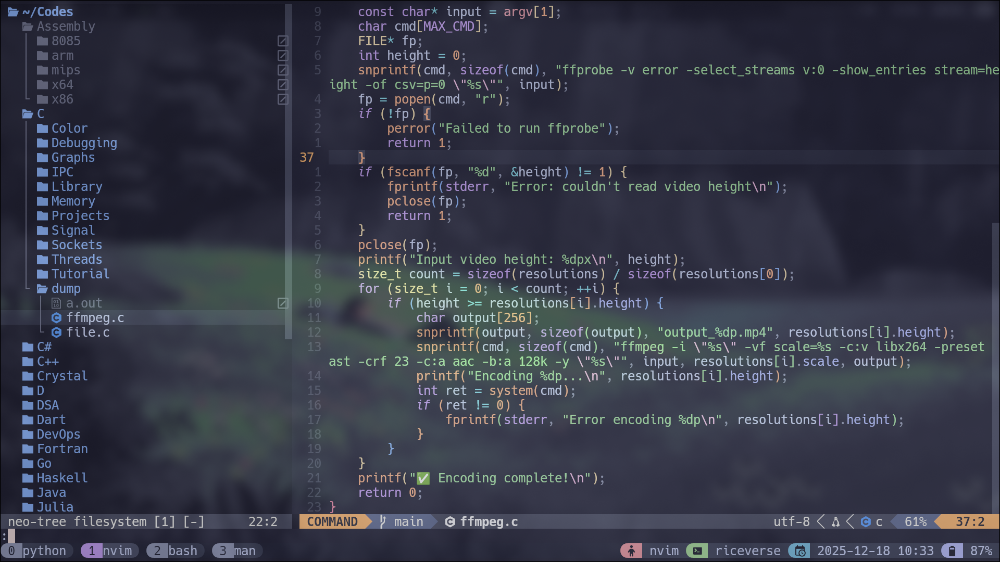
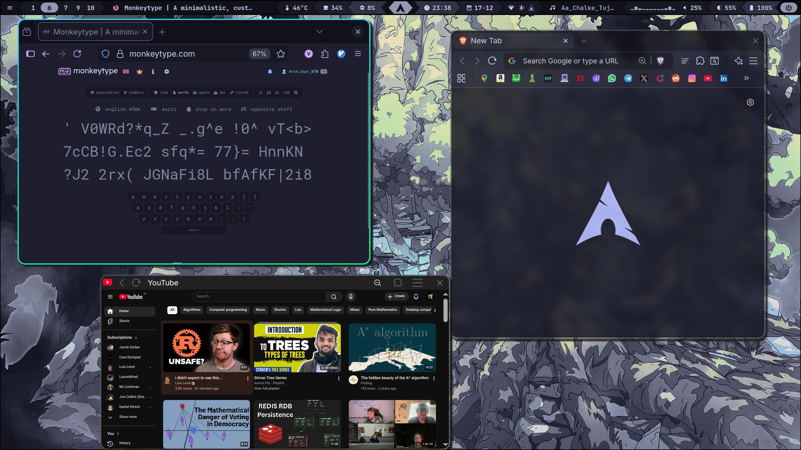
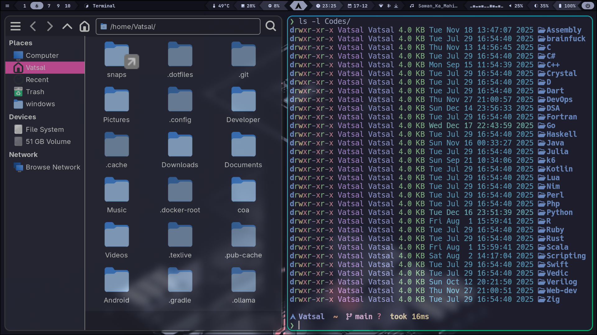
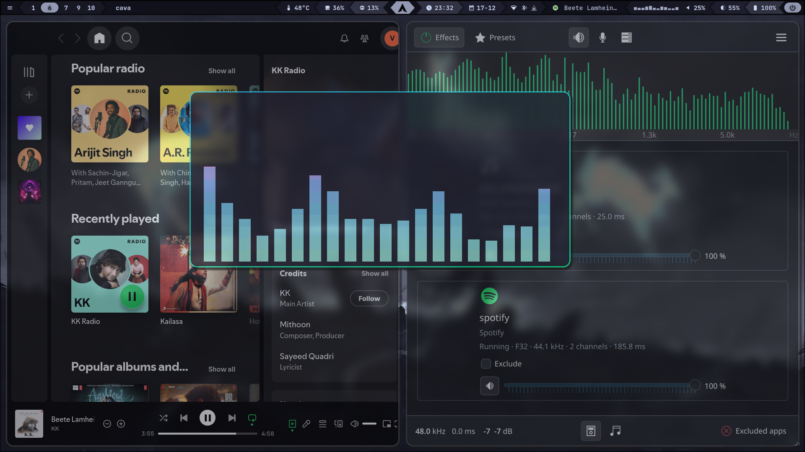
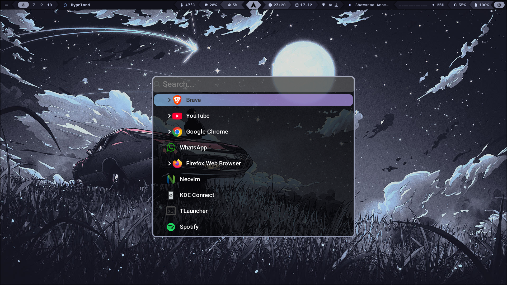

# RiceVerse

**RiceVerse** is a modular dotfiles configuration for Arch Linux. This repository uses **GNU Stow** to treat every configuration group (Shell, Desktop, Dev Tools) as a separate package.

This architecture allows for **surgical installation**: deploy the entire environment or just the components you need (e.g., only Neovim or only the Terminal setup) without polluting your system.

## 📸 Gallery

<table align="center">
  <tr>
    <td colspan="6" align="center">
      <h3>✨ The Rice (Hyprland)</h3>
      
    </td>
  </tr>

  <tr>
    <td colspan="3" align="center">
        <b>💻 Neovim IDE</b><br>
        
    </td>
    <td colspan="3" align="center">
        <b>🌐 Browser</b><br>
        
    </td>
  </tr>

  <tr>
    <td colspan="2" align="center">
        <b>📂 Thunar Files</b><br>
        
    </td>
    <td colspan="2" align="center">
        <b>🎵 Music (Cava)</b><br>
        
    </td>
    <td colspan="2" align="center">
        <b>🚀 Wofi Launcher</b><br>
        
    </td>
  </tr>
</table>

## Project Architecture

The repository is structured to separate configuration logic (Payloads) from installation logic (Scripts).

```text
~/riceverse
├── assets/             # Screenshots & logos
├── gui-tools/          # GTK 3/4, Kvantum, Thunar configs
├── hyprland/           # Hyprland, Waybar, Rofi, Wofi, SwayNC
├── nvim/               # Lua-based Neovim IDE
├── scripts/            # Automation (install.sh / uninstall.sh)
├── shell/              # Bash, Zsh, Starship
├── suckless/           # Source code for DWM, ST, Dmenu
├── terminal/           # Kitty, Tmux, Fastfetch, Bat
├── tools/              # MPD, Cava, Zathura, GDB, Clang
└── Wallpapers/         # 4K Wallpapers

```

## Details & Features

| Module | Components | Description |
| --- | --- | --- |
| **Desktop** | `Hyprland`, `Waybar`, `Wofi` | Blur-heavy tiling WM with animated bars and app launchers. |
| **Shell** | `Starship`, `Fastfetch` | Instant-load shell with custom prompt and visual fetchers. |
| **Editor** | `Neovim` | Full IDE with LSP, Treesitter, DAP, and Telescope. |
| **Terminal** | `Kitty`, `Tmux` | GPU-accelerated terminal with session management. |
| **Suckless** | `DWM`, `ST`, `Dmenu` | Patched source code managed locally in `.config`. |
| **Media** | `MPD`, `Cava`, `MPV` | Music server with visualizers. |

## Installation Guide

### Prerequisites

* **OS:** Arch Linux (Recommended)
* **Packages:** `git`, `stow` (The script attempts to install these, but having them helps).

### 1. Clone the Repository

```bash
git clone https://github.com/Vatsalj17/riceverse.git ~/.dotfiles
cd ~/.dotfiles
```

### 2. Run the Installer

The script `scripts/install.sh` handles dependency resolution (via `pacman`/`yay`) and symlinking.

**Option A: Full Installation (Recommended)**
Installs every module, resolves all dependencies, and compiles suckless tools.

```bash
chmod +x scripts/install.sh
./scripts/install.sh
```

**Option B: Modular Installation**
Only want specific parts? Pass the folder names as arguments.

```bash
# Example: Install only Neovim and the Terminal environment
./scripts/install.sh nvim terminal
```

**Option C: Headless / Minimal**
Install only the shell (Zsh/Starship) and Git configs.

```bash
./scripts/install.sh shell tools
```

> **Note:** The installer automatically backs up existing configs to prevent conflicts using Stow's `--adopt` strategy.

## Uninstallation Guide

To safely remove configurations without breaking your system packages:

```bash
chmod +x scripts/uninstall.sh
./scripts/uninstall.sh
```

* **Selective Removal:** `./scripts/uninstall.sh nvim` (Removes only Neovim links).
* **Safety:** This script removes *symlinks* and cleans up `make uninstall` for suckless tools. It does **not** remove system packages (like `hyprland` or `firefox`) to avoid dependency breakage.

## Critical Keybinds

The workflow is keyboard-centric, utilizing `Super` (Windows Key) and Vim motions.

* **General:**
* `Super` + `Enter`: Terminal (Kitty)
* `Super` + `Space`: App Launcher (Wofi)
* `Super` + `E`: File Manager (Thunar)
* `Super` + `X`: Lock Screen


* **Window Management:**
* `Super` + `H/J/K/L`: Focus Window
* `Super` + `Ctrl` + `H/J/K/L`: Move Window
* `Super` + `Q`: Close Window
* `Super` + `F`: Toggle Floating


* **Power User:**
* `Alt` + `S`: **OCR / Image-to-Text** (Custom Python Script)
* `Super` + `V`: Clipboard History
* `Super` + `W`: Wallpaper Selector
* `Super` + `I`: Emofi Clipboard

## 🙏 Acknowledgements

- [Catppuccin](https://github.com/catppuccin) for their beautiful color schemes
- The Hyprland and Arch Linux communities for inspiration and resources
- [Dry_Increase7287](https://www.reddit.com/user/Dry_Increase7287/comments/1cmc96k/wofi_configuration/) for the Wofi configuration  
- [Sejjy](https://github.com/sejjy/mechabar) for the Waybar configuration
- [Typecraft Dev](https://github.com/typecraft-dev) for Neovim and Tmux configurations  

---

*Maintained by [Vatsal Jaiswal](https://github.com/Vatsalj17)*
