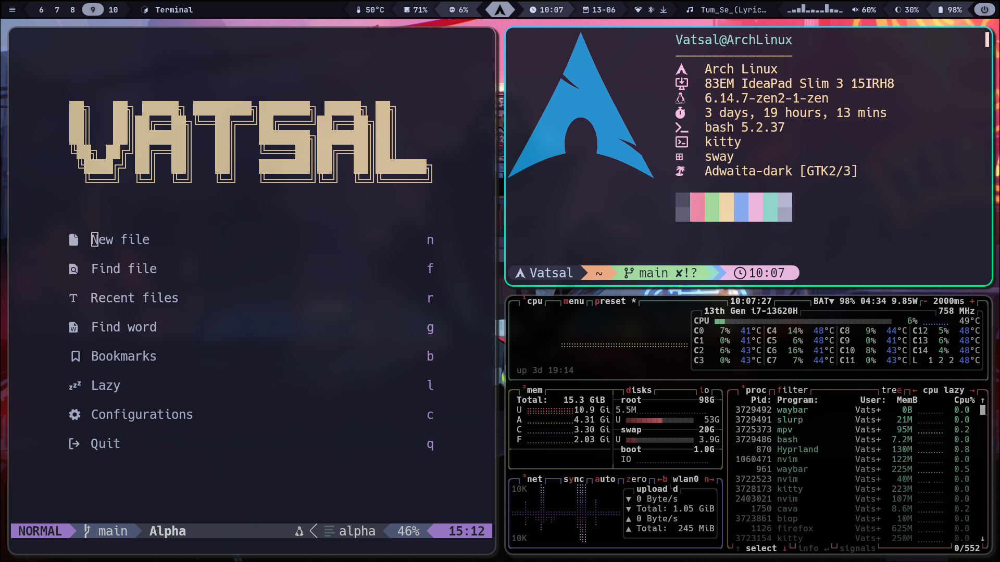

# Ricebowl

My custom Hyprland + Arch Linux configuration files, carefully tuned for both aesthetics and performance. This repo contains all my personal dotfiles for creating a sleek, efficient, and functional desktop environment.



## 📑 Navigation

- [Features](#-features)
- [What's Included](#-whats-included)
- [Installation](#-installation)
  - [Quick Install](#quick-install)
  - [Manual Installation](#manual-installation)
- [Dependencies](#️-dependencies)
- [Customization](#-customization)
- [Screenshots](#-more-screenshots)
- [Acknowledgements](#-acknowledgements)

## ✨ Features

- **Hyprland** configuration optimized for workflow efficiency
- **Neovim** setup with essential plugins and custom keybindings
- **Kitty** terminal with custom theme and settings
- **Waybar** with a clean, information-rich layout
- **Tmux** configuration with Catppuccin theme integration
- Additional configs for Cava, Cmus, Rofi, Wofi, and more

## 📦 What's Included

```
├── config/
│   ├── cava/            # Audio visualizer config
│   ├── cmus/            # Music player config
│   ├── fastfetch/       # System info fetcher config
│   ├── hypr/            # Hyprland window manager config
│   ├── kitty/           # Terminal emulator config
│   ├── mpv/             # Media player config
│   ├── neofetch/        # System info fetcher config
│   ├── nvim/            # Text editor config
│   ├── qt6ct/           # Qt6 configuration
│   ├── rofi/            # Application launcher config
│   ├── starship.toml    # Shell prompt config
│   ├── Thunar/          # File manager config
│   ├── tmux/            # Terminal multiplexer config
│   ├── waybar/          # Status bar config
│   └── wofi/            # Application launcher config
├── home/                # Dotfiles for $HOME directory
│   ├── .bash_profile
│   ├── .bashrc
│   ├── .clang-format
│   └── .tmux.conf
└── install.sh           # Installation script
```

## 🚀 Installation

### Quick Install

```bash
git clone https://github.com/Vatsalj17/ricebowl.git
cd ricebowl
./install.sh
```

The installation script will:
- Create necessary directories
- Back up your existing configurations
- Copy all dotfiles to their appropriate locations
- Install the Catppuccin theme for Tmux

### Manual Installation

If you prefer to install manually or just want specific components:

1. Clone this repository:
   ```bash
   git clone https://github.com/Vatsalj17/ricebowl.git
   ```

2. Copy the desired configuration folders to your `~/.config` directory:
   ```bash
   cp -r ricebowl/config/FOLDER_NAME ~/.config/
   ```

3. For home directory files:
   ```bash
   cp ricebowl/home/FILE_NAME ~/
   ```

4. For Tmux with Catppuccin theme:
   ```bash
   mkdir -p ~/.config/tmux/plugins
   git clone https://github.com/catppuccin/tmux ~/.config/tmux/plugins/catppuccin
   ```

## ⚙️ Dependencies

This configuration works best with:

- Arch Linux (or other Linux distributions)
- Hyprland
- Kitty terminal
- Neovim
- Tmux
- Waybar
- Rofi/Wofi

Install basic dependencies on Arch with:
```bash
sudo pacman -S hyprland kitty neovim tmux waybar rofi
```

## 🎨 Customization

Feel free to modify any of these configurations to suit your preferences:

- Colors and themes can be adjusted in individual config files
- Keybindings are primarily defined in `hypr/binds.conf` and respective application configs
- Waybar modules can be modified in `waybar/config.jsonc` and styled in `waybar/style.css`

## 📸 More Screenshots

#### Neovim


#### Thunar File Manager


#### Tmux


#### Applauncher (wofi)


#### Music


#### Browsing


## 🙏 Acknowledgements

- [Catppuccin](https://github.com/catppuccin) for their beautiful color schemes
- The Hyprland and Arch Linux communities for inspiration and resources

---

**Enjoy your new Hyprspace configuration!** 🚀
